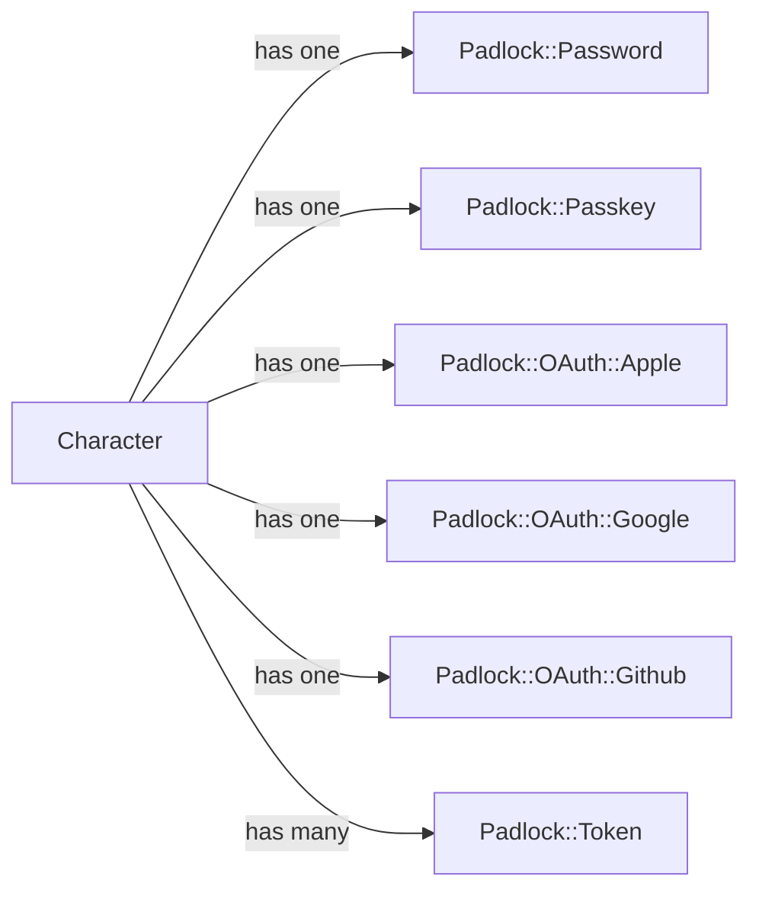
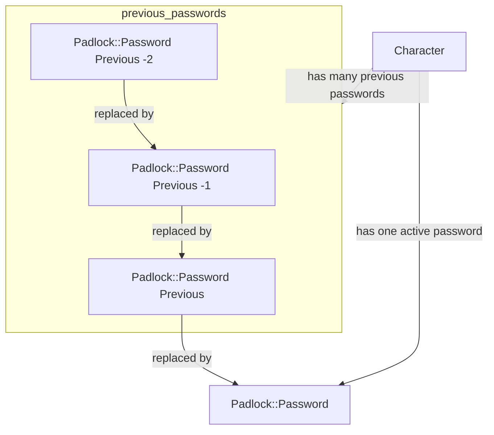

# Locks and Keys (Authentication Data Model)

## Abstract

The authentication model for DRGN is inspired by the concept of locks and keys used on Search Action games
(Metroidvania). In DRGN a user is call a `Character`. Each `Character` contains and links user data, configurations,
authorizations and subsystems of the platform.

So for the user to authenticate into its `Character` they use a key which unlocks a `Padlock` and granting them access
to DRGN. A key can be a password, a secure token, some passkey, OAuth, MFA, etc., basically any type of authentication
method we like to implement for the system. A `Character` can have more than one `Padlock`.

So reading into this, a high level visualization of the data model will be something like this:

> [!IMPORTANT]
> The following graph is an example, not a product roadmap. There's a possibility some of the hypothesized implementations
> end up implemented in a later date. Also, you can take these hypothetical implementations implement them yourself and
> gift them to the community.

So, each `Character` will be implemented using Single Table Inheritance (STI) over a character table. While each
`Padlock` will be implemented using namespaced models each stored in their own table. Because each one probably needs 
its own data implementation, and making a super extensible architecture that exchange speed for flexibility will make
them overengineered.

Taking this into consideration the next section will represent each implementation and the version it was included at.

## Specifications

> [!NOTE]
> This is a living document, so its constantly being updated to include new the implementation specs for our Locks and
> Keys.

### Character (v0.1)

The `Character` base model represents of a user on the data model of DRGN. It contains some basic information required
to identify the user for authentication and information display.

#### v0.1

##### Table Design

| Column     | Type                     | Constraints             | Usage                                                                                                                                                                       |
|------------|--------------------------|-------------------------|-----------------------------------------------------------------------------------------------------------------------------------------------------------------------------|
| id         | integer (auto-increment) | index, pk, not null     |                                                                                                                                                                             |
| tag        | string                   | index, not null, unique | Use to identify the user, it is a unique system name                                                                                                                        |
| deleted_at | datetime                 | index                   | (Optional) Timestamp indicating when the record was marked for deletion. Soft deletion is used to remove the record from the UI while the system erase it in the background |
| created_at | datetime                 | not null                |                                                                                                                                                                             |
| updated_at | datetime                 | not null                |                                                                                                                                                                             |

### Password Padlock (v0.1)

A `Padlock::Password` is a padlock that every user has not only used for authentication to enter the application. But
also to enforce a protection layer for dangerous modifications to the platform that the user can perform that can cause
wild changes on behavior or massive data lost.

For some level of security the system will remember a history of previous passwords, to prevent the user from reusing
the same password for security reasons. The number would be controlled by a platform wide setting so the administrator
or manager can control how many passwords will be remembered for this system.

> [!NOTE]
> The way platform settings will be stored are yet to be designed!

This password history feature is structured using a linked list like structure in the database, storing a reference/pointer
(nullable foreign key like column) to the `Padlock::Password` that replaced the record. Because how the platform is
expected to work it is assumed that the value stored on the `updated_at` column marks the timestamp of when the password
was replaced. A high level overview of these design can be visualized with the following graph

#### v0.1

##### Table Design

| Column             | Type                     | Constraints         | Usage                                                                                                                                 |
|--------------------|--------------------------|---------------------|---------------------------------------------------------------------------------------------------------------------------------------|
| id                 | integer (auto-increment) | index, pk, not null |                                                                                                                                       |
| character_id       | integer                  | index, fk, not null | A pointer/reference to the character this padlock locks                                                                               |
| replacement_key_id | integer                  | index               | (Optional) A pointer/reference to the record that replaced this record as the active padlock/key. Used for a password history feature |
| key                | string                   |                     | The secure hashed and salted password use for authentication                                                                          |
| expires_at         | date                     | not null            | A simple expiration date use to tell the user to change its password for security                                                     |
| unlocked_by        | integer(enum)            | not null            | An ActiveRecord enum that indicates which action last unlocked the padlock record                                                     |
| last_unlocked_at   | datetime                 | not null            | A timestamp that stores the last time the padlock record was unlocked at (login or system modification confirmation)                  |
| created_at         | datetime                 | not null            |                                                                                                                                       |
| updated_at         | datetime                 | not null            |                                                                                                                                       |

