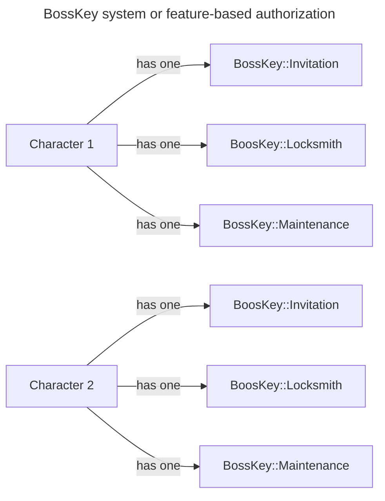
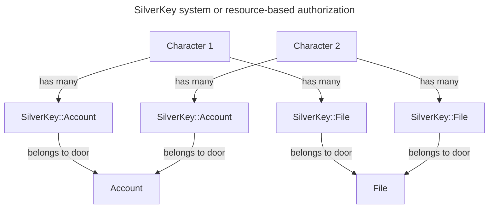

# Boss Keys (Authorization Data Model)

## Abstract

One of the oldest game design principles is locks and keys. Usually based around locked doors to which the player must 
unlock by finding a key or the correct key and bringing it to the door. The oldest implementations simply required finding
a key that can unlock any door; later it evolved to having different types of keys for different types of doors, famously
The Legend of Zelda's Boss Key to access the dungeon's boss room and Silver Keys to access more dungeaon's sections.
While games like Metal Gear and DOOM used color-coded keys to open different doors, Yellow keys for Yellow doors, or
Level 2 keys for Level 2 doors. If we go to Metroidvania/Search Action games, the equipment the player has unlocked also
works as keys; in 2D Metroid the player uses Samus' Cannon Beams and Missiles to open doors, some doors require upgraded
to unlock, like a Charged Beam or Wave Beam to open some doors and Super Missiles to others.

The authorization system in DRGN is a mix of both concepts. From The Legend of Zelda we take `BoosKey` as the base model
or namespace for feature keys, and `SilverKey` as the base model or namespace for resource keys. Meanwhile, from Metroid
we take the upgrade requirement as a level of access control mechanism with Metal Gear's terminology; so each key model
should have a `access_level` attribute that indicates the level of access the key grantz a the `Character` that holds it;
becuase Ruby does not have interfaces, this column is our contract on the implementation side in case a generalist
implementation is not possible for expansion of this system.

So the idea is that in DRGN each `Character` has many `BoosKey`, one per protected feature, each having a `access_level`
attribute that indicates the level of access the `Character` has to the feature; making modeling the problem of
authorizing relatively straightforward. So, we can visualize this high-level design following this graph:

> [!IMPORTANT]
> The following graph is an example, not a product roadmap. There's a possibility some of the hypothesized implementations
> end up implemented at a later date. Also, you can take these hypothetical implementations implement them yourself and
> gift them to the community.

On the other hand, the `SilverKey` system is a bit more complex, but follows a similar pattern. Each `Character` has many
`SilverKey` record, each record belongs to a `door` record, depending on requirements defined later on the `Specification`
section; a `door` is a protected resource that can be accessed by a `Character` that holds the respective `SilverKey`
record according to its `access_level`.

## Specification

> [!NOTE]
> This is a living document, so it's constantly being updated to include new the implementation specs for our Locks and
> Keys.

### Boss Key (v0.1) base record

A `BossKey` is a record that represents a permission to access a feature on DRGN. It contains the basic information
needed to authorize a `Character` to access a feature by setting an `access_level`. Is important to remember that
`BossKey` uses STI (Single Table Inheritance) to implement the different types of permissions; so we control the behavior
of the `BossKey` by the implementation of its submodels.

Because of the engineering decisions [we made](../README.md) the amount of `BossKey` records on the application will be
relatively under control, because it will be one per user, per feature; and with no more than 10 to 20 registered `Character`
records at any time we can assume there will not be more than 200 `BossKey` records in the entire database. 

#### v0.1

##### Table Design

| Column       | Type                     | Constraints         | Usage                                                                                                                                                                       |
|--------------|--------------------------|---------------------|-----------------------------------------------------------------------------------------------------------------------------------------------------------------------------|
| id           | integer (auto-increment) | index, pk, not null |                                                                                                                                                                             |
| type         | string                   | index, not null     | Used by ActiveRecord for its STI (Single Table Inherintance) feature, it identifies which `BossKey` implementation the record loads                                         |
| access_level | integer(enum)            | not null, default 0 | An ActiveRecord enum to control the level of access a character has to the feature or resource                                                                              |
| holder_id    | integer                  | index, fk, not null | A pointer/reference the character that holds the key                                                                                                                        |
| deleted_at   | datetime                 | index               | (Optional) Timestamp indicating when the record was marked for deletion. Soft deletion is used to remove the record from the UI while the system erase it in the background |
| created_at   | datetime                 | not null            |                                                                                                                                                                             |
| updated_at   | datetime                 | not null            |                                                                                                                                                                             |

### Silver Key (v0.1) base record

On the otherside, a `SilverKey` is a record that represents a permission to access a resource on DRGN. It contains the
basic information needed to authorize a `Character` to access a resource by setting an `access_level`. Is important to
remember that `SilverKey` also uses STI (Single Table Inheritance) to implement the different types of permissions;
so we control the behavior of the `SilverKey` by the implementation of its submodels, like what kind of resource it
protects.

#### v0.1

##### Table Design

| Column       | Type                     | Constraints         | Usage                                                                                                                                                                       |
|--------------|--------------------------|---------------------|-----------------------------------------------------------------------------------------------------------------------------------------------------------------------------|
| id           | integer (auto-increment) | index, pk, not null |                                                                                                                                                                             |
| type         | string                   | index, not null     | Used by ActiveRecord for its STI (Single Table Inherintance) feature, it identifies which `SilverKey` implementation the record loads                                       |
| access_level | integer(enum)            | not null, default 0 | An ActiveRecord enum to control the level of access a character has to the feature or resource                                                                              |
| holder_id    | integer                  | index, fk, not null | A pointer/reference the character that holds the key                                                                                                                        |
| door_type    | string                   | index               | The half of an ActiveRecord polymorphic association that indicates the class name of the `door` record to which this `SilverKey` record belongs to                          |
| door_id      | integer                  | index               | The half of an ActiveRecord polymorphic association that indicates the id of the `door` record to which this `SilverKey` record belongs to                                  |
| deleted_at   | datetime                 | index               | (Optional) Timestamp indicating when the record was marked for deletion. Soft deletion is used to remove the record from the UI while the system erase it in the background |
| created_at   | datetime                 | not null            |                                                                                                                                                                             |
| updated_at   | datetime                 | not null            |                                                                                                                                                                             |
