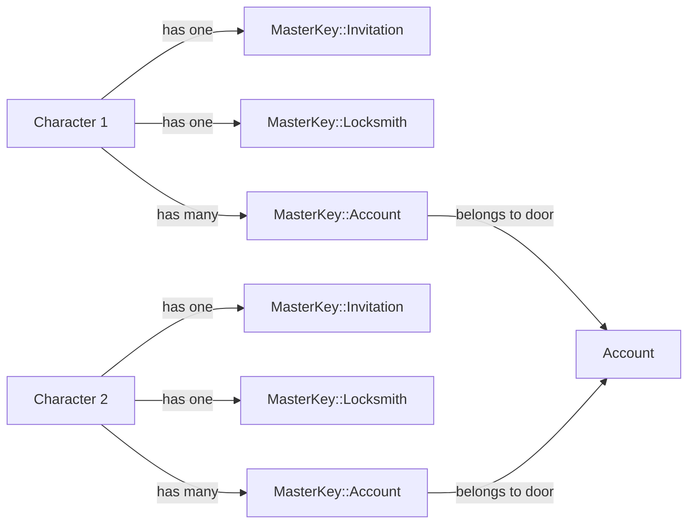

# The Good Old Color Keys System (Authorization Data Model)

## Abstract

One of the oldest game design principles is locks and keys. Usually based around locked doors to which the player must 
unlock by finding a key or the correct key and bringing it to the door. The oldest implementations simply required finding
a key that can unlock any door; later it evolved to having different types of keys for different types of doors, famously
The Legend of Zelda Boss Key to access the dungeon's boss room. But this system is inspiried by Metal Gear security level
keys and DOOM's color keys.

The big difference is that this system mixes both concepts of Metal Gear and DOOM. A Character has a colored key that has
different levels of access to the feature that the `MasterKey` protects. This is nothing more than a feature-based role
authorization system, but with a game design twist.

In DRGN each `Character` has many `MasterKey`, one per feature or as many needed to build the platform's authorization
system. The `MasterKey` model uses STI (Single Table Inheritance) to implement each permission, where the type of key
represents the permission. Each `MasterKey` has a `Character` that holds it under holder association. And at the same time
it includes a door polymorphic association that later will be used to implement resource-based authorization.

So, we can visualize this high-level design following this graph:

> [!IMPORTANT]
> The following graph is an example, not a product roadmap. There's a possibility some of the hypothesized implementations
> end up implemented at a later date. Also, you can take these hypothetical implementations implement them yourself and
> gift them to the community.

The idea is that the `MasterKey` models allow us to build a powerful authorization system that can be used to protect
features and resources on the platform.

## Specification

> [!NOTE]
> This is a living document, so it's constantly being updated to include new the implementation specs for our Locks and
> Keys.

### Master Key (v0.1) base record

A `MasterKey` is a record that represents a permission to access a feature or resource on DRGN. It contains the basic
information needed to authorize a `Character` to access a feature or resource by setting an `access_level`. Is important
to remember that `MasterKey` uses STI (Single Table Inheritance) to implement the different types of permissions; so we
control the behavior of the `MasterKey` by the implementation of its submodels.

To give it more power to the `MasterKey` model it contais a `door` polymorphic association that later will be used to
implement resource-based authorization. I know this implementation violates the Single Responsibility Principle, but
for me this is a trade-off that I'm willing to make, because of performance and simplicity. For this class of
implementations using Delegated Types is recommended to maintain separation of concerns and the table clean; but DRGN
is not expected to be such a big project nor have a super complex authorization system, and most of the `MasterKey`
implementations are expected to use this `door` association, while just a lesser amount will not.

How this will scale, feature-based authorization basically will scale feature per holder, where features are
programmatically limited DRGN code necessities, meanwhile holders are user-generated. While resource-based authorization
will scale per holder per resource, where both are user-generated, making so it can scale in crazy ways depending on how
many DRGN users there are and how many protected resources there are at any moment. But as said in the [Introduction to
this technical documentation](../README.md) we do not expect the application to be used by more than 10 users in the
worse case scenario.

#### v0.1

##### Table Design

| Column       | Type                     | Constraints         | Usage                                                                                                                                                                       |
|--------------|--------------------------|---------------------|-----------------------------------------------------------------------------------------------------------------------------------------------------------------------------|
| id           | integer (auto-increment) | index, pk, not null |                                                                                                                                                                             |
| type         | string                   | index, not null     | Used by ActiveRecord for its STI (Single Table Inherintance) feature, it identifies which `MasterKey` implementation the record loads                                       |
| access_level | integer(enum)            | not null, default 0 | An ActiveRecord enum to control the level of access a character has to the feature or resource                                                                              |
| holder_id    | integer                  | index, fk, not null | A pointer/reference the character that holds the key                                                                                                                        |
| door_type    | string                   | index               | The half of an ActiveRecord polymorphic association that indicates the class name of the `door` record to which this `MasterKey` record belongs to                          |
| door_id      | integer                  | index               | The half of an ActiveRecord polymorphic association that indicates the id of the `door` record to which this `MasterKey` record belongs to                                  |
| deleted_at   | datetime                 | index               | (Optional) Timestamp indicating when the record was marked for deletion. Soft deletion is used to remove the record from the UI while the system erase it in the background |
| created_at   | datetime                 | not null            |                                                                                                                                                                             |
| updated_at   | datetime                 | not null            |                                                                                                                                                                             |
