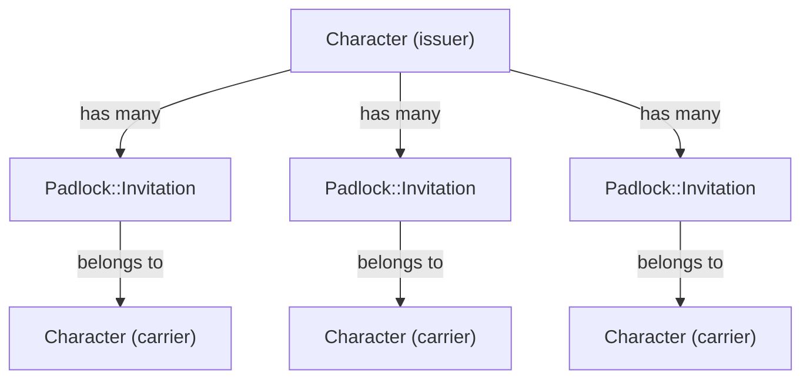

# This is a private Party (Invitations Data Model)

## Abstract

DRGN is thought on game design principles. So for user registration, we can think of users in the platform as a party of
adventurers [`Character`](https://github.com/NordGus/drgn/blob/1aaace13e24827ad4c109f4d4a8e8c24138d7dac/docs/authentication/data_model.md)
embarking on this journey of financial literacy and freedom. But the world is a dangerous place, and we need to be
careful of whom we let us join us on our journey.

For this reason user registration, or `Character` creation from here onwards, is controlled via `Invitation`. An
`Invitation` is a new type of `Padlock` that any `Character` who has access to the Invitations settings can create and
share with others. A single use, expirable `Invitation` is the only way to open the gate to your world of DRGN.

So the idea is that a `Character` has many `Invitation` as an issuer while another `Character` has only one as carrier.
Nothing complex.

The idea is for this Invitation system to also work as the control access to the platform. When a trusted `Character`
or the protagonist (root `Character` also known as the first `Character` created) decided to delete a `Character` from
the platform, it will use its invitation to identify and destroy such `Character`. So this system can not only be used
to invite users to join the platform but also to remove them from it.

## Specification

> [!NOTE]
> This is a living document, so it's constantly being updated to include new the implementation specs for our Locks and
> Keys.

### Padlock Invitation (v0.1)

A `Padlock::Invitation` is a `Padlock` that can be used once by a user to create their own `Character`. Which can only be
issued by a `Character` with the `Padlock::Admin::Invitation` key.

#### v0.1

##### Table Design

| Column           | Type                     | Constraints         | Usage                                                                                                                                                                       |
|------------------|--------------------------|---------------------|-----------------------------------------------------------------------------------------------------------------------------------------------------------------------------|
| id               | integer (auto-increment) | index, pk, not null |                                                                                                                                                                             |
| issuer_id        | integer                  | index, fk, not null | A pointer/reference to the character who issued this padlock                                                                                                                |
| carrier_id       | integer                  | index, fk           | (Optional) A pointer/reference to the created using this invitation                                                                                                         |
| key              | string                   | index               | The secure token used to unlock this padlock                                                                                                                                |
| expires_at       | datetime                 | not null            | A simple expiration date expired this invitation to prevent usage after a configurable amount of time                                                                       |
| last_unlocked_at | datetime                 | not null            | A timestamp that stores the last time the padlock record was unlocked at                                                                                                    |
| deleted_at       | datetime                 | index               | (Optional) Timestamp indicating when the record was marked for deletion. Soft deletion is used to remove the record from the UI while the system erase it in the background |
| created_at       | datetime                 | not null            |                                                                                                                                                                             |
| updated_at       | datetime                 | not null            |                                                                                                                                                                             |
