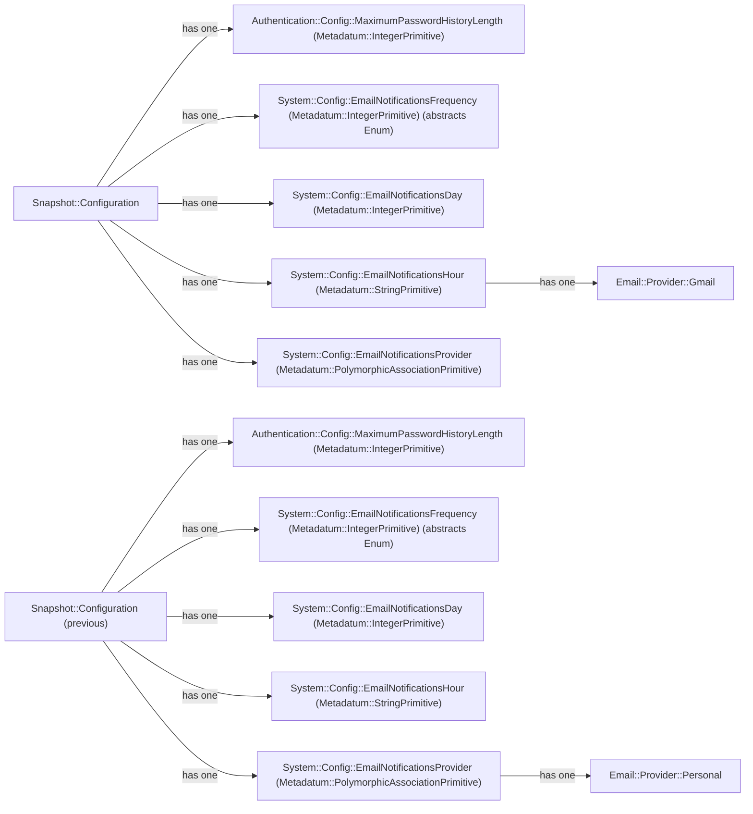

# If Single Table Inheritance, Polymorphic Associations and Background Jobs are hammers, every data modeling problem is a nail

---

An Entity Component System approach to data modeling approach to extend other models or give them metadata. Allowing
DRGN to encapsulate behaviors and use ActionJob to build subsystems to compose the entire DRGN's system.

---

## Abstract

The idea is to design a group of `Metadatum` models which are derived from a set of primitives/parents models. These
primitives represent is base data type that ActiveRecord support, while each implementation is build using Ruby-on-Rails
Single Table Inheritance that defines the polymorphic associations with the rest of DRGN data model.

So each `Metadatum` is a Component on the Entity Component System that will be build using Ruby-on-Rails ActionJob.

A change history feature can be build using a direct reference to a `Metadatum` in the same table that replaced such
`Metadatum` so the history is basically a Linked List of `Metadatum` nodes. Where the head is the oldest `Metadatum` in
the chain and its tail is the newest node who has the reference empty.

Deletion control will be done through the Systems build on top of ActiveRecord or the models who owns each `Metadatum`.

This concept will be used to extend models which operate in multiple Systems which implementation does not have to be
super specialized or need to be contained in a single entity for performance reasons (an example will be authentication
related models).

> [!IMPORTANT]
> The following graph is an example, not a product roadmap. There's a possibility some of the hypothesized
> implementations end up implemented in a later date. Also, you can take these hypothetical implementations implement
> them yourself and gift them to the community.

