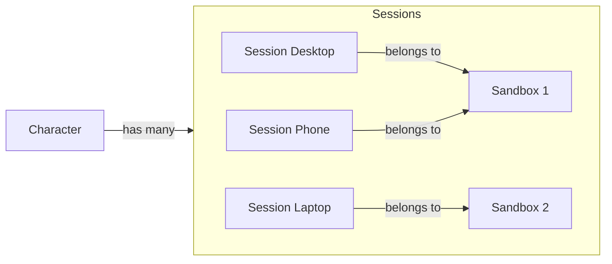

# SSD-Based Database Session store

## Abstract

Inspired by Ruby-on-Rails' latest obsession with modern high performance SSDs to use your database as the backend for
the ActionCable, ActionJob and Cache (Solid Stack) and the new authentication generator. DRGN stores its sessions in
the main database as a `Session` record.

The store is simple, only contains minimal amount of data, mostly references to key records like authenticated user
reference and the accessed data sandbox for quick lookup. This allows DRGN to expire/remove sessions for users or
sandboxes that no longer exists. At the same time this can store other important references for fast retrieval and
small storage footprint on the database.

This design also allows for quick extension by adding more columns depending on the feature. While having the
shortcoming that it can become a really wide row table, but DRGN is not expected to be that big and complex of an
application.

So reading into this, a high level visualization of the data model will be something like this:

> [!IMPORTANT]
> The following graph is an example, not a product roadmap. There's a possibility some of the hypothesized implementations
> end up implemented in a later date. Also, you can take these hypothetical implementations implement them yourself and
> gift them to the community.

## Specifications

To identify the `Session` in the system it uses `has_secure_token` so DRGN won't leak the internal ids and uses the token
to retrieve the `Session` from the database on authentication.

> [!NOTE]
> This is a living document, so its constantly being updated to include new the implementation specs for our Locks and
> Keys.

### Session (v0.1)

The `Session` model stores a user's session information on the data model of DRGN. It contains some basic information
required to represent the users interactions with DRGN.

#### v0.1

##### Table Design

| Column       | Type                     | Constraints         | Usage                                                                |
|--------------|--------------------------|---------------------|----------------------------------------------------------------------|
| id           | integer (auto-increment) | index, pk, not null |                                                                      |
| token        | string                   | index, not null     | Secure token to identify the record and retrive it at authentication |
| character_id | integer                  | index, not null, fk | Use to identify the user that the session belongs to                 |
| created_at   | datetime                 | not null            | This will be use to expire the sessions in the system                |
| updated_at   | datetime                 | not null            |                                                                      |
