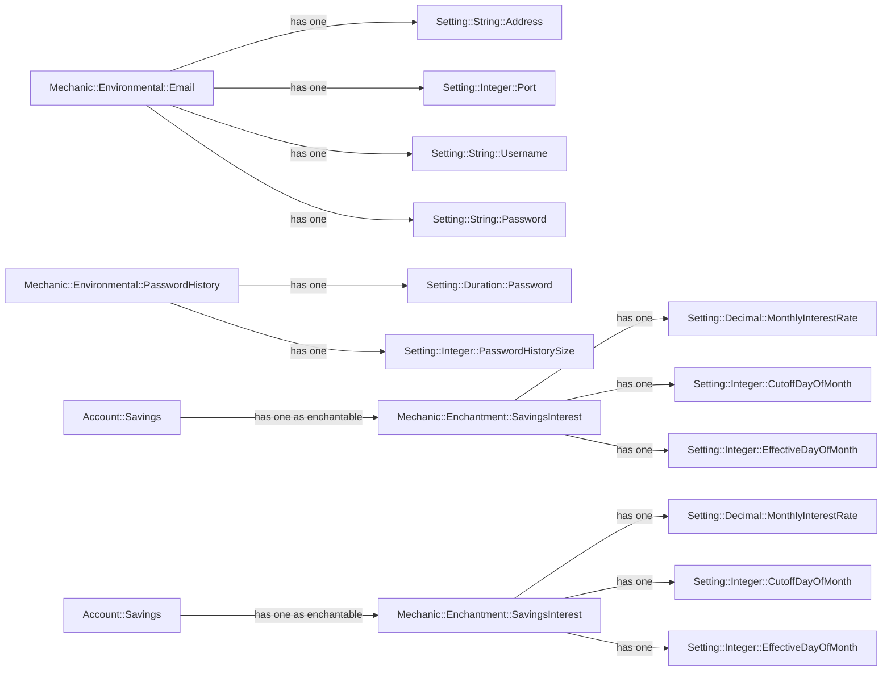

# Mechanics - Personalization so Dungeon Masters can make their own DRGN

## Abstract

Two deployments of DRGN aren't supposed to be same, Dungeon Masters have the capacity to personalized their instances to
behave the way they like inside the framework the DRGN platform provides to manage their personal finances.

While there's a baseline for each deployment, the idea is for the platform to be highly customizable from the get-go so
Dungeon Masters can build their own flavors from day one or Nth day.

One thing I've learned while dabling onto Game Development in Unity and Godot is that the code should be written to be
easily configurable and extensible by designers; so they can take the systems and mechanichs as building blocks to make
new systems and mechanichs in interesting ways.

So the idea requires three models to work. A base `Setting::<Type>` model that holds the value of each setting and
contains a reference to one of two container models; a `Mechanic::Environmental` model that groups many `Setting::<Type>`
records and represent a platform-wide mechanics or a `Mechanic::Enchantment` that groups many `Setting::<Type>` records and
associate them to a `enchantable` record and represents the behavior of how the mechanic will affect that record.

> [!IMPORTANT]
> The following graph is an example, not a product roadmap. There's a possibility some of the hypothesized implementations
> end up implemented in a later date. Also, you can take these hypothetical implementations implement them yourself and
> gift them to the community.

So each `Mechanic` will be implemented using Single Table Inheritance (STI) over one of two tables `mechanic_environmentals`
for platform-wide systems and `mechanic_enchantments` for resource-specific systems.

## Specification

> [!NOTE]
> This is a living document, so it's constantly being updated to include new the implementation specs for Mechanics
> system.

## Mechanic::Environmental (v0.1)

A `Mechanic::Environmental` is a record that represents a sub-system or mechanic in the database use only to group all
user defined settings values into an easily accessible and controllable interface.

### v0.1

#### Table Design

| Column         | Type                     | Constraints             | Usage                                                                                                                                                                                                                                |
|----------------|--------------------------|-------------------------|--------------------------------------------------------------------------------------------------------------------------------------------------------------------------------------------------------------------------------------|
| id             | integer (auto-increment) | index, pk, not null     |                                                                                                                                                                                                                                      |
| type           | string                   | index, not null, unique | Used by ActiveRecord for its STI (Single Table Inherintance) feature, it identifies which `Mechanic::Environmental` implementation the record loads                                                                                  |
| deleted_at     | datetime                 | index                   | (Optional) Timestamp indicating when the record was decomissioned. Soft deletion is used to decommision `Mechanic::Environmental` when the mechanic is no longer in use or has been replaced by a non retrocompatible implementation |
| created_at     | datetime                 | not null                |                                                                                                                                                                                                                                      |
| updated_at     | datetime                 | not null                |                                                                                                                                                                                                                                      |

## Mechanic::Enchantment (v0.1)

A `Mechanic::Enchantment` is a record that represents record's configuration for a sub-system or mechanic in the database
use to group the user defined settings values, for the given record, into an easily accessible and controllable way;
this allows the user to change the way the sub-system or mechanic affects it or works with the `enchantable` record.

### v0.1

#### Table Design

| Column           | Type                     | Constraints             | Usage                                                                                                                                                                       |
|------------------|--------------------------|-------------------------|-----------------------------------------------------------------------------------------------------------------------------------------------------------------------------|
| id               | integer (auto-increment) | index, pk, not null     |                                                                                                                                                                             |
| type             | string                   | index, not null, unique | Used by ActiveRecord for its STI (Single Table Inherintance) feature, it identifies which `Mechanic::Enchantment` implementation the record loads                           |
| deleted_at       | datetime                 | index                   | (Optional) Timestamp indicating when the record was marked for deletion. Soft deletion is used to remove the record from the UI while the system erase it in the background |
| enchantable_type | string                   | index                   | The half of an ActiveRecord polymorphic association that indicates the class name of the `echantable` record to which this `Mechanic::Enchantment` record belongs to        |
| enchantable_id   | integer                  | index                   | The half of an ActiveRecord polymorphic association that indicates the id of the `echantable` record to which this `Mechanic::Enchantment` record belongs to                |
| created_at       | datetime                 | not null                |                                                                                                                                                                             |
| updated_at       | datetime                 | not null                |                                                                                                                                                                             |
