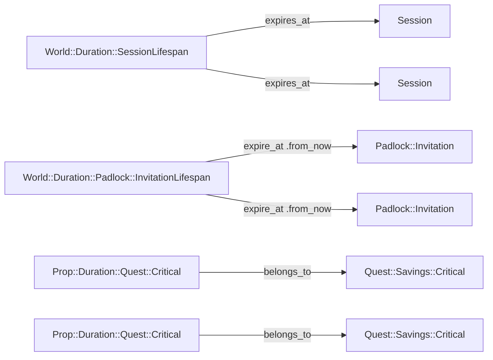

# Not all spells are single-use. Without a way to define how long they can last you can't balance them.

## Abstract

Some features of DRGN need some kind of lifetime or duration for certain resources, for example how long an unused
invitation can last before it expires or how long a character's session lasts before been asked to reauthenticate on the
system.

For this type of configurations we can make use of the power of Ruby-on-Rails and Ruby to build a powerful abstraction
for a primitive on top of which build our platform. So the idea is that the platform has a `World::Duration` primitive
to describe system-wide settings and `Prop::Duration` for resource-specific settings.

> [!IMPORTANT]
> The following graph is an example, not a product roadmap. There's a possibility some of the hypothesized implementations
> end up implemented in a later date. Also, you can take these hypothetical implementations implement them yourself and
> gift them to the community.

Because we'll be building these settings as primitives we need to make use of Single Table Inheritance to implement
specific settings records; which can implement their own validations and restrictions. 